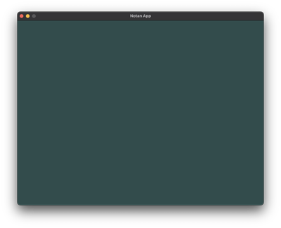
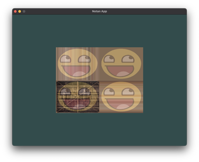
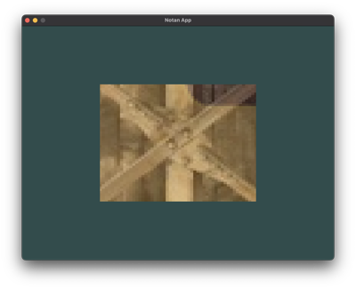

LearnOpenGL-Notan
====

Port of [LearnOpenGL](https://learnopengl.com/) exercises using [Notan](https://github.com/Nazariglez/notan).

I tried to make the examples as close to the originals from [LearnOpenGL Examples C++](https://github.com/JoeyDeVries/LearnOpenGL). 
However, a few things can be different because Notan uses [Rust](https://www.rust-lang.org/) and it's graphic API is not a 1:1 port of OpenGL API. 

To run the examples use `cargo run --bin 1_1` where `1_1` is the numeration.

## 1 Getting started

### 1.1 Hello window
Create a window.

* [Demo](https://nazariglez.github.io/LearnOpenGL-Notan/1_1.html)
* [Source](./src/_1_getting_started/_1_1_hello_window.rs)
* [Tutorial](https://learnopengl.com/Getting-started/Creating-a-window)

### 1.2 Hello window clear 
Create a window and clear the screen.

* [Demo](https://nazariglez.github.io/LearnOpenGL-Notan/1_2.html)
* [Source](./src/_1_getting_started/_1_2_hello_window_clear.rs)
* [Tutorial](https://learnopengl.com/Getting-started/Hello-Window)

### 2.1 Hello triangle
Draw a triangle

* [Demo](https://nazariglez.github.io/LearnOpenGL-Notan/2_1.html)
* [Source](./src/_1_getting_started/_2_1_hello_triangle.rs)
* [Tutorial](https://learnopengl.com/Getting-started/Hello-Triangle)

### 2.2 Hello triangle indexed
Draw a triangle using an element buffer object to reuse vertices

* [Demo](https://nazariglez.github.io/LearnOpenGL-Notan/2_2.html)
* [Source](./src/_1_getting_started/_2_2_hello_triangle_indexed.rs)
* [Tutorial](https://learnopengl.com/Getting-started/Hello-Triangle)

### 2.3 Hello triangle exercise 1
Two triangles adding vertices to the same VBO

* [Demo](https://nazariglez.github.io/LearnOpenGL-Notan/2_3.html)
* [Source](./src/_1_getting_started/_2_3_hello_triangle_exercise1.rs)
* [Tutorial](https://learnopengl.com/Getting-started/Hello-Triangle)

### 2.4 Hello triangle exercise 2
Two triangles using two different VBOs

* [Demo](https://nazariglez.github.io/LearnOpenGL-Notan/2_4.html)
* [Source](./src/_1_getting_started/_2_4_hello_triangle_exercise2.rs)
* [Tutorial](https://learnopengl.com/Getting-started/Hello-Triangle)

### 2.5 Hello triangle exercise 3
Two triangles using two different Pipelines and VBOs

* [Demo](https://nazariglez.github.io/LearnOpenGL-Notan/2_5.html)
* [Source](./src/_1_getting_started/_2_5_hello_triangle_exercise3.rs)
* [Tutorial](https://learnopengl.com/Getting-started/Hello-Triangle)
 
### 3.1 Shaders uniform
Change the color of the triangle using a uniform buffer object

* [Demo](https://nazariglez.github.io/LearnOpenGL-Notan/3_1.html)
* [Source](./src/_1_getting_started/_3_1_shaders_uniform.rs)
* [Tutorial](https://learnopengl.com/Getting-started/Shaders)

### 3.2 Shaders interpolation
Show how shaders interpolate colors

* [Demo](https://nazariglez.github.io/LearnOpenGL-Notan/3_2.html)
* [Source](./src/_1_getting_started/_3_2_shaders_interpolation.rs)
* [Tutorial](https://learnopengl.com/Getting-started/Shaders)

### 3.3 Shaders Class (NOT DONE)
This example doesn't apply to Notan. 
* [Tutorial](https://learnopengl.com/Getting-started/Shaders)

### 3.4 Shaders exercise 1
Invert the triangle's Y axis 

* [Demo](https://nazariglez.github.io/LearnOpenGL-Notan/3_4.html)
* [Source](./src/_1_getting_started/_3_4_shaders_exercise1.rs)
* [Tutorial](https://learnopengl.com/Getting-started/Shaders)

### 3.5 Shaders exercise 2
Move the triangle to the right passing an offset value as uniform

* [Demo](https://nazariglez.github.io/LearnOpenGL-Notan/3_5.html)
* [Source](./src/_1_getting_started/_3_5_shaders_exercise2.rs)
* [Tutorial](https://learnopengl.com/Getting-started/Shaders)

### 3.6 Shaders exercise 3
Using the vertex position as colors

* [Demo](https://nazariglez.github.io/LearnOpenGL-Notan/3_6.html)
* [Source](./src/_1_getting_started/_3_6_shaders_exercise3.rs)
* [Tutorial](https://learnopengl.com/Getting-started/Shaders)

### 4.1 Textures
Draw a texture

* [Demo](https://nazariglez.github.io/LearnOpenGL-Notan/4_1.html)
* [Source](./src/_1_getting_started/_4_1_textures.rs)
* [Tutorial](https://learnopengl.com/Getting-started/Textures)

### 4.2 Textures combined
Combine two textures in the same shader

* [Demo](https://nazariglez.github.io/LearnOpenGL-Notan/4_2.html)
* [Source](./src/_1_getting_started/_4_2_textures_combined.rs)
* [Tutorial](https://learnopengl.com/Getting-started/Textures)

### 4.3 Textures exercise 1
Invert the X axis in the shader for the happy face

* [Demo](https://nazariglez.github.io/LearnOpenGL-Notan/4_3.html)
* [Source](./src/_1_getting_started/_4_3_textures_exercise1.rs)
* [Tutorial](https://learnopengl.com/Getting-started/Textures)
 
### 4.4 Textures exercise 2
Change the wrapping method on the happy face to repeat

* [Demo](https://nazariglez.github.io/LearnOpenGL-Notan/4_4.html)
* [Source](./src/_1_getting_started/_4_4_textures_exercise2.rs)
* [Tutorial](https://learnopengl.com/Getting-started/Textures)

### 4.5 Textures exercise 3
Display only the center of the texture changing texture coords

* [Demo](https://nazariglez.github.io/LearnOpenGL-Notan/4_5.html)
* [Source](./src/_1_getting_started/_4_5_textures_exercise3.rs)
* [Tutorial](https://learnopengl.com/Getting-started/Textures)

### 4.6 Textures exercise 4
Use a uniform to change the mix value. 
Use the keyboard arrows Up and Down to change the value

* [Demo](https://nazariglez.github.io/LearnOpenGL-Notan/4_6.html)
* [Source](./src/_1_getting_started/_4_6_textures_exercise4.rs)
* [Tutorial](https://learnopengl.com/Getting-started/Textures)

### 5.1 Transformations
Translate and rotate the container

* [Demo](https://nazariglez.github.io/LearnOpenGL-Notan/5_1.html)
* [Source](./src/_1_getting_started/_5_1_transformations.rs)
* [Tutorial](https://learnopengl.com/Getting-started/Transformations)

### 5.2 Transformations exercise 1
Change the rotation point of the container

* [Demo](https://nazariglez.github.io/LearnOpenGL-Notan/5_2.html)
* [Source](./src/_1_getting_started/_5_2_transformations_exercise1.rs)
* [Tutorial](https://learnopengl.com/Getting-started/Transformations)

### 5.3 Transformations exercise 2
Add a new continer and translate and scale it, while keep translating and rotating the first one.

* [Demo](https://nazariglez.github.io/LearnOpenGL-Notan/5_3.html)
* [Source](./src/_1_getting_started/_5_3_transformations_exercise2.rs)
* [Tutorial](https://learnopengl.com/Getting-started/Transformations)

### 6.1 Coordinate systems
Add a matrix projection to alter how the contains is displayed

* [Demo](https://nazariglez.github.io/LearnOpenGL-Notan/6_1.html)
* [Source](./src/_1_getting_started/_6_1_coordinate_systems.rs)
* [Tutorial](https://learnopengl.com/Getting-started/Coordinate-Systems)

### 6.2 Coordinate systems depth
Transform our container in a Cube (3d)

* [Demo](https://nazariglez.github.io/LearnOpenGL-Notan/6_2.html)
* [Source](./src/_1_getting_started/_6_2_coordinate_systems_depth.rs)
* [Tutorial](https://learnopengl.com/Getting-started/Coordinate-Systems)

### 6.3 Coordinate systems multiple
Draw multiple cubes

* [Demo](https://nazariglez.github.io/LearnOpenGL-Notan/6_3.html)
* [Source](./src/_1_getting_started/_6_3_coordinate_systems_multiple.rs)
* [Tutorial](https://learnopengl.com/Getting-started/Coordinate-Systems)
 
### 6.4 Coordinate systems exercises 3
Rotate every 3rd container over time

* [Demo](https://nazariglez.github.io/LearnOpenGL-Notan/6_4.html)
* [Source](./src/_1_getting_started/_6_4_coordinate_systems_exercise3.rs)
* [Tutorial](https://learnopengl.com/Getting-started/Coordinate-Systems)
 
